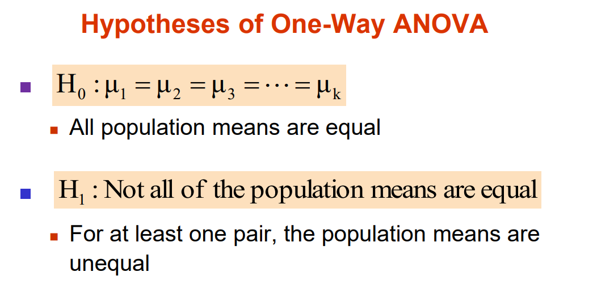

# Anova
Anova from Scratch

## Objective
* The objective of this project is to create a function for ONE WAY ANOVA Test from scratch with numpy and pandas.
* The results from the test are F_statistic and P_value, which are used for Hypothesis Testing

## Libraries Required
* Pandas
* Numpy
* Typing

## Hypothesis testing

**H0 :  All means are not equal**

**Ha :  Atleast two population means are not equal**

